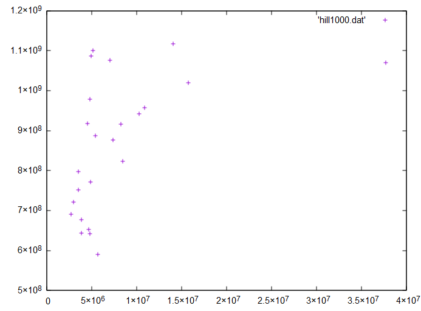

# TPHeuristiques 
réalisation du Tp heuristiques

## Travail réalisé :

Nous avons reussi la totalité des question concernant l'heuristique constructive et la recherche local.
Cependant nous avons eu des soucis au niveau de l'implementation de hill climbing au sein de l'ILS.
Nous obtenons tout de meme des solutions plus optimisées avec ILS mais nos données ne sont pas très fiables à cause de ce problème.

## Initialisation :

Voici comment nous avons découpé le problème :

la classe Tache est un objet composé de plusieurs elements :
 - le temps d'execution d'une tache
 - le poid d'une tache
 - la durée limite d'éxecution d'une tache

la classe TacheOrd est un objet composé de plusieurs elements correspondant a une tache ordonnée :
 - le temps d'execution d'une tache
 - le poid d'une tache
 - la durée limite d'éxecution d'une tache
 - le retard d'une tache
 - la completion d'une tache

Pour la suite nous avons décomposé en plusieurs classe : 
 - les heuristiques sont implementées dans la classe PblJSP
 - la recherche locale est implementée dans la classe HillClimbing
 - ILS est implémenté dans la classe Ils

## Heursitques constructives:

- Génération aléatoire : Nous avons ordonnancé les Taches aléatoirement
- Heuristique 1 : Nous avons décidé de rechercher le minimum du ratio durée limite sur poid de la tache.

## Recherche locale (Hill Climbing):

Pour notre recherche local, nous avons utilisé un algo en Hill Climbing. Nous partons d'une solution initiale (donnée par notre heuristique)
En ce qui concerne le voisinage, on genere le voisin en cherchant à partir de la tache courrante la prochaine tache en retard.
ensuite nous effectuons une permutation de ces 2 taches afin de minimiser la qualité de notre solution.
Si ce n'est pas le cas nous n'effectuons pas la permuttation et nous passons à la tache suivante. 
Comme nous pouvons le voir sur ce graphique, cette méthode est plus performante sur tout type de données que les heuristiques précedements réalisées

## Échapper aux optima locaux (ILS)

Pour echapper aux optima locaux, notre algorithme est composé de 3 points principaux:
Tout d'abord nous construisons une solution initiale à l'aide d'une heuristique constructive.
Nous cherchons a minimiser la qualité de notre solutions a l'aide d'une recherche locale.
Lorsque nous avons atteint le sommet de notre région, nous appliquons une perturbations afin de changer de milieu  

## Compagne d’expérimentation et analyse :

### Pour les graphiques : 
 - abscisse = temps d'execution (en nano secondes)
 - ordonnée = qualité calculée

Tous les résultats sont obtenus assez rapidement mais nous pouvons voir que les resulats sont "eparpillés".

Les resultats sont obtenus assez rapidement mais la qualité n'est pas optimale. Cependant, on peut voir que l'aspect "eparpillés" est beaucoup moins marqué.

Pour le Hill Climbing les temps d'execution sont assez long, cependant on gagne en présision. On peut voir qu'il y a beaucoup plus de qualité inferieur à 50 000. Les valeurs les plus grandes ont été optimisé. La qualité la plus grande est passée de 300 000 à 250 000.

Nous pouvons voir un interval très réduit, 160 000 au lieux de 300 000(divisé par 2) ! Cependant certains resultats peuvent prendre plus de temps à être calculé par rapport au autres méthodes.

## Challenge

